# Hey-Bills Test Automation Framework
## QA Specialist - Implementation Guide

This document provides a comprehensive guide for implementing automated testing in the Hey-Bills Flutter application, including setup instructions, best practices, and maintenance guidelines.

---

## 🚀 Framework Overview

### Testing Architecture

```mermaid
graph TB
    A[Test Automation Framework] --> B[Unit Tests]
    A --> C[Widget Tests]  
    A --> D[Integration Tests]
    A --> E[E2E Tests]
    A --> F[Performance Tests]
    A --> G[Security Tests]
    
    B --> B1[Business Logic]
    B --> B2[Models & Services]
    B --> B3[Utilities]
    
    C --> C1[UI Components]
    C --> C2[State Management]
    C --> C3[Navigation]
    
    D --> D1[API Integration]
    D --> D2[Database Operations]
    D --> D3[Authentication]
    
    E --> E1[User Journeys]
    E --> E2[Cross-Platform]
    E --> E3[Device Testing]
    
    F --> F1[Performance Benchmarks]
    F --> F2[Memory Usage]
    F --> F3[Battery Impact]
    
    G --> G1[Security Vulnerabilities]
    G --> G2[Data Protection]
    G --> G3[Access Control]
```



### Technology Stack

| Component | Technology | Purpose |
|-----------|------------|---------|
| **Test Runner** | Flutter Test | Core testing framework |
| **Mocking** | Mockito | Mock dependencies and external services |
| **Coverage** | lcov | Code coverage analysis |
| **E2E Testing** | Flutter Integration Test | End-to-end scenarios |
| **Performance** | Flutter Driver | Performance benchmarking |
| **CI/CD** | GitHub Actions | Automated pipeline |
| **Reporting** | Codecov | Coverage reporting |
| **Device Testing** | Firebase Test Lab | Cloud device testing |

---

## 📁 Project Structure

```
hey-bills/
├── test/
│   ├── unit/                          # Unit tests
│   │   ├── models/                    # Model tests
│   │   ├── services/                  # Service tests
│   │   ├── utils/                     # Utility tests
│   │   └── fixtures/                  # Test data
│   ├── widget/                        # Widget tests
│   │   ├── screens/                   # Screen widget tests
│   │   ├── components/                # Component widget tests
│   │   └── common/                    # Shared widget tests
│   ├── integration/                   # Integration tests
│   │   ├── auth/                      # Authentication tests
│   │   ├── api/                       # API integration tests
│   │   └── database/                  # Database tests
│   ├── e2e/                          # End-to-end tests
│   │   ├── user_journeys/             # Complete user flows
│   │   ├── regression/                # Regression test suites
│   │   └── smoke/                     # Smoke tests
│   ├── performance/                   # Performance tests
│   │   ├── benchmarks/                # Performance benchmarks
│   │   ├── memory/                    # Memory usage tests
│   │   └── load/                      # Load testing
│   ├── security/                      # Security tests
│   │   ├── auth/                      # Authentication security
│   │   ├── data/                      # Data protection tests
│   │   └── vulnerabilities/           # Security vulnerability tests
│   ├── accessibility/                 # Accessibility tests
│   │   ├── screen_reader/             # Screen reader compatibility
│   │   ├── contrast/                  # Color contrast tests
│   │   └── navigation/                # Keyboard navigation
│   ├── helpers/                       # Test helper functions
│   │   ├── mock_data.dart            # Mock data generators
│   │   ├── test_utils.dart           # Common test utilities
│   │   └── matchers.dart             # Custom matchers
│   └── fixtures/                      # Test fixtures and data
│       ├── images/                    # Test images for OCR
│       ├── receipts/                  # Sample receipt data
│       └── responses/                 # Mock API responses
├── integration_test/                  # Integration test app
│   ├── app_test.dart                 # Main integration tests
│   ├── auth_flow_test.dart           # Authentication flow tests
│   ├── receipt_flow_test.dart        # Receipt management tests
│   └── warranty_flow_test.dart       # Warranty tracking tests
├── test_driver/                       # Test drivers
│   └── integration_test.dart         # Integration test driver
├── scripts/                           # Test automation scripts
│   ├── setup_test_env.sh             # Test environment setup
│   ├── run_all_tests.sh              # Run complete test suite
│   ├── generate_mocks.sh             # Generate mock classes
│   └── coverage_report.sh            # Generate coverage reports
└── .github/
    └── workflows/
        └── test.yml                   # CI/CD pipeline configuration
```

---

## 🛠️ Setup Instructions

### 1. Install Dependencies

Add the following dependencies to your `pubspec.yaml`:

```yaml
dev_dependencies:
  flutter_test:
    sdk: flutter
  integration_test:
    sdk: flutter
  flutter_driver:
    sdk: flutter
  test: ^1.24.0
  mockito: ^5.4.0
  build_runner: ^2.4.0
  json_serializable: ^6.6.0
  fake_async: ^1.3.0
  flutter_launcher_icons: ^0.13.0
  
  # Performance testing
  flutter_performance_timeline: ^0.1.0
  
  # Accessibility testing
  flutter_accessibility_service: ^0.2.0
  
  # Security testing
  flutter_secure_storage: ^9.0.0
```

### 2. Generate Mock Classes

Create a `test/helpers/mock_generators.dart` file:

```dart
import 'package:mockito/annotations.dart';
import 'package:supabase_flutter/supabase_flutter.dart';
import 'package:hey_bills/services/auth_service.dart';
import 'package:hey_bills/services/receipt_service.dart';
import 'package:hey_bills/services/warranty_service.dart';

// Generate mocks for these classes
@GenerateMocks([
  SupabaseClient,
  GoTrueClient,
  PostgRESTClient,
  StorageApi,
  AuthService,
  ReceiptService,
  WarrantyService,
])
void main() {}
```

Run the code generation:

```bash
dart run build_runner build
```

### 3. Configure Test Environment

Create `.env.test` file:

```bash
SUPABASE_URL=https://test-project.supabase.co
SUPABASE_ANON_KEY=test-anon-key
SUPABASE_SERVICE_ROLE_KEY=test-service-role-key
ENVIRONMENT=test
DEBUG_MODE=true
SENTRY_DSN=https://test-sentry-dsn
```

### 4. Setup Test Database

Create `scripts/setup_test_db.sql`:

```sql
-- Test database schema
CREATE SCHEMA IF NOT EXISTS test_hey_bills;

-- Test users table
CREATE TABLE test_hey_bills.users (
    id UUID PRIMARY KEY DEFAULT gen_random_uuid(),
    email VARCHAR(255) UNIQUE NOT NULL,
    full_name VARCHAR(255) NOT NULL,
    business_type VARCHAR(50) NOT NULL,
    created_at TIMESTAMP WITH TIME ZONE DEFAULT NOW(),
    updated_at TIMESTAMP WITH TIME ZONE DEFAULT NOW()
);

-- Test receipts table
CREATE TABLE test_hey_bills.receipts (
    id UUID PRIMARY KEY DEFAULT gen_random_uuid(),
    user_id UUID NOT NULL REFERENCES test_hey_bills.users(id),
    merchant_name VARCHAR(255) NOT NULL,
    total_amount DECIMAL(10,2) NOT NULL,
    category VARCHAR(100) NOT NULL,
    ocr_data JSONB,
    image_url TEXT,
    created_at TIMESTAMP WITH TIME ZONE DEFAULT NOW()
);

-- Test warranties table
CREATE TABLE test_hey_bills.warranties (
    id UUID PRIMARY KEY DEFAULT gen_random_uuid(),
    user_id UUID NOT NULL REFERENCES test_hey_bills.users(id),
    product_name VARCHAR(255) NOT NULL,
    purchase_date DATE NOT NULL,
    warranty_end_date DATE NOT NULL,
    alert_preferences JSONB,
    created_at TIMESTAMP WITH TIME ZONE DEFAULT NOW()
);

-- Enable Row Level Security for all tables
ALTER TABLE test_hey_bills.users ENABLE ROW LEVEL SECURITY;
ALTER TABLE test_hey_bills.receipts ENABLE ROW LEVEL SECURITY;
ALTER TABLE test_hey_bills.warranties ENABLE ROW LEVEL SECURITY;

-- RLS Policies
CREATE POLICY "Users can only see their own data" ON test_hey_bills.users
    FOR ALL USING (auth.uid() = id);

CREATE POLICY "Users can only see their own receipts" ON test_hey_bills.receipts
    FOR ALL USING (auth.uid() = user_id);

CREATE POLICY "Users can only see their own warranties" ON test_hey_bills.warranties
    FOR ALL USING (auth.uid() = user_id);
```

---

## 🎯 Test Configuration

### Test Constants

Create `test/helpers/test_constants.dart`:

```dart
class TestConstants {
  // Test user credentials
  static const String testEmail = 'test@heybills.example.com';
  static const String testPassword = 'TestPassword123!';
  static const String testUserId = 'test-user-uuid';
  
  // Test data
  static const String testMerchantName = 'Test Store';
  static const double testAmount = 25.99;
  static const String testCategory = 'groceries';
  
  // Test timeouts
  static const Duration shortTimeout = Duration(seconds: 5);
  static const Duration mediumTimeout = Duration(seconds: 15);
  static const Duration longTimeout = Duration(seconds: 30);
  
  // Performance thresholds
  static const int maxAppLaunchTime = 3000; // ms
  static const int maxOcrProcessingTime = 5000; // ms
  static const int maxApiResponseTime = 200; // ms
  
  // Coverage requirements
  static const double minCoverageThreshold = 85.0; // %
  
  // Test file paths
  static const String testReceiptImage = 'test/fixtures/images/test_receipt.jpg';
  static const String testMockData = 'test/fixtures/mock_data.json';
}
```

### Test Base Classes

Create `test/helpers/test_base.dart`:

```dart
import 'package:flutter/services.dart';
import 'package:flutter_test/flutter_test.dart';
import 'package:mockito/mockito.dart';
import 'package:supabase_flutter/supabase_flutter.dart';
import 'mock_generators.mocks.dart';

abstract class TestBase {
  late MockSupabaseClient mockSupabase;
  late MockGoTrueClient mockAuth;
  late MockPostgRESTClient mockDatabase;
  late MockStorageApi mockStorage;

  @mustCallSuper
  void setUp() {
    mockSupabase = MockSupabaseClient();
    mockAuth = MockGoTrueClient();
    mockDatabase = MockPostgRESTClient();
    mockStorage = MockStorageApi();

    when(mockSupabase.auth).thenReturn(mockAuth);
    when(mockSupabase.from(any)).thenReturn(mockDatabase);
    when(mockSupabase.storage).thenReturn(mockStorage);

    // Setup common mock responses
    setupCommonMocks();
  }

  void setupCommonMocks() {
    // Setup default auth mock
    when(mockAuth.currentUser).thenReturn(
      User(
        id: TestConstants.testUserId,
        email: TestConstants.testEmail,
        createdAt: DateTime.now().toIso8601String(),
        appMetadata: {},
        userMetadata: {},
        aud: 'authenticated',
      ),
    );

    // Setup default database mock
    when(mockDatabase.select()).thenReturn(mockDatabase);
    when(mockDatabase.eq(any, any)).thenReturn(mockDatabase);
    when(mockDatabase.order(any)).thenReturn(mockDatabase);
    when(mockDatabase.limit(any)).thenReturn(mockDatabase);
  }

  @mustCallSuper
  void tearDown() {
    reset(mockSupabase);
    reset(mockAuth);
    reset(mockDatabase);
    reset(mockStorage);
  }
}
```

---

## 📊 Test Data Management

### Mock Data Generator

Create `test/helpers/mock_data.dart`:

```dart
import 'dart:math';
import 'package:hey_bills/models/receipt.dart';
import 'package:hey_bills/models/warranty.dart';
import 'package:hey_bills/models/user.dart';

class MockDataGenerator {
  static final Random _random = Random();

  // Generate mock users
  static List<User> generateUsers(int count) {
    return List.generate(count, (index) => User(
      id: 'user-$index',
      email: 'user$index@example.com',
      fullName: 'Test User $index',
      businessType: ['freelancer', 'small_business', 'individual'][index % 3],
      createdAt: DateTime.now().subtract(Duration(days: _random.nextInt(365))),
    ));
  }

  // Generate mock receipts
  static List<Receipt> generateReceipts(int count, {String? userId}) {
    final merchants = ['Walmart', 'Target', 'Amazon', 'Costco', 'Home Depot'];
    final categories = ['groceries', 'dining', 'shopping', 'gas', 'utilities'];

    return List.generate(count, (index) => Receipt(
      id: 'receipt-$index',
      userId: userId ?? 'test-user',
      merchantName: merchants[_random.nextInt(merchants.length)],
      totalAmount: _random.nextDouble() * 500 + 10,
      category: categories[_random.nextInt(categories.length)],
      date: DateTime.now().subtract(Duration(days: _random.nextInt(90))),
      ocrData: {
        'confidence': 0.8 + _random.nextDouble() * 0.2,
        'items': ['Item ${index + 1}', 'Item ${index + 2}'],
      },
      imageUrl: 'https://example.com/receipt-$index.jpg',
    ));
  }

  // Generate mock warranties
  static List<Warranty> generateWarranties(int count, {String? userId}) {
    final products = ['iPhone 15', 'MacBook Pro', 'Samsung TV', 'KitchenAid Mixer'];
    final warrantyPeriods = [365, 730, 1095]; // 1, 2, 3 years

    return List.generate(count, (index) => Warranty(
      id: 'warranty-$index',
      userId: userId ?? 'test-user',
      productName: products[_random.nextInt(products.length)],
      purchaseDate: DateTime.now().subtract(Duration(days: _random.nextInt(365))),
      warrantyPeriod: Duration(days: warrantyPeriods[_random.nextInt(warrantyPeriods.length)]),
      alertPreferences: {
        'email': true,
        'push': true,
        'days_before': [30, 7, 1],
      },
    ));
  }

  // Generate spending data for analytics
  static Map<String, dynamic> generateSpendingData(int days) {
    final categories = <String, double>{};
    final dailySpending = <String, double>{};
    double totalSpent = 0;

    for (int i = 0; i < days; i++) {
      final date = DateTime.now().subtract(Duration(days: i));
      final daySpending = _random.nextDouble() * 100 + 10;
      
      dailySpending[date.toIso8601String().split('T')[0]] = daySpending;
      totalSpent += daySpending;
    }

    // Distribute spending across categories
    final categoryNames = ['groceries', 'dining', 'gas', 'shopping', 'utilities'];
    for (final category in categoryNames) {
      categories[category] = totalSpent * (0.1 + _random.nextDouble() * 0.3);
    }

    return {
      'total_spent': totalSpent,
      'categories': categories,
      'daily_spending': dailySpending,
      'period_days': days,
    };
  }

  // Generate test images for OCR
  static List<int> generateMockImage(int width, int height) {
    // Generate simple test image data
    final imageData = <int>[];
    
    // PNG header
    imageData.addAll([137, 80, 78, 71, 13, 10, 26, 10]);
    
    // Simplified image data (would be proper PNG data in real implementation)
    for (int i = 0; i < width * height * 3; i++) {
      imageData.add(_random.nextInt(256));
    }
    
    return imageData;
  }

  // Generate test receipt OCR responses
  static Map<String, dynamic> generateOcrResponse({double? confidence}) {
    return {
      'merchant_name': 'Test Store ${_random.nextInt(100)}',
      'total_amount': (_random.nextDouble() * 200 + 5).toStringAsFixed(2),
      'date': DateTime.now().subtract(Duration(days: _random.nextInt(7))).toIso8601String(),
      'items': [
        'Item 1',
        'Item 2', 
        'Item 3',
      ],
      'confidence': confidence ?? (0.8 + _random.nextDouble() * 0.2),
      'processing_time': _random.nextInt(3000) + 500, // 500-3500ms
    };
  }
}
```

### Test Fixtures

Create test fixture files in `test/fixtures/`:

```json
// test/fixtures/responses/auth_success.json
{
  "access_token": "mock-access-token",
  "token_type": "bearer",
  "expires_in": 3600,
  "refresh_token": "mock-refresh-token",
  "user": {
    "id": "test-user-id",
    "email": "test@example.com",
    "email_confirmed_at": "2024-01-01T00:00:00Z",
    "phone": "",
    "confirmed_at": "2024-01-01T00:00:00Z",
    "last_sign_in_at": "2024-01-01T00:00:00Z",
    "app_metadata": {
      "provider": "email"
    },
    "user_metadata": {
      "full_name": "Test User"
    }
  }
}
```

```json
// test/fixtures/responses/receipts_list.json
{
  "data": [
    {
      "id": "receipt-1",
      "user_id": "test-user-id",
      "merchant_name": "Walmart",
      "total_amount": 45.67,
      "category": "groceries",
      "date": "2024-01-15T10:30:00Z",
      "image_url": "https://storage.example.com/receipts/receipt-1.jpg"
    },
    {
      "id": "receipt-2", 
      "user_id": "test-user-id",
      "merchant_name": "Shell",
      "total_amount": 52.34,
      "category": "gas",
      "date": "2024-01-14T08:15:00Z",
      "image_url": "https://storage.example.com/receipts/receipt-2.jpg"
    }
  ],
  "count": 2
}
```

---

## 🚀 Test Automation Scripts

### Run All Tests Script

Create `scripts/run_all_tests.sh`:

```bash
#!/bin/bash
set -e

echo "🧪 Running Hey-Bills Complete Test Suite"
echo "========================================"

# Colors for output
RED='\033[0;31m'
GREEN='\033[0;32m'
YELLOW='\033[1;33m'
NC='\033[0m' # No Color

# Function to print colored output
print_status() {
    echo -e "${2}${1}${NC}"
}

# Function to run tests and capture results
run_test_suite() {
    local test_name="$1"
    local test_command="$2"
    
    print_status "Running $test_name..." $YELLOW
    
    if $test_command; then
        print_status "✅ $test_name passed" $GREEN
        return 0
    else
        print_status "❌ $test_name failed" $RED
        return 1
    fi
}

# Initialize test results
total_suites=0
passed_suites=0
failed_suites=()

# Ensure dependencies are installed
print_status "Installing dependencies..." $YELLOW
flutter pub get
dart pub global activate coverage

# Generate mocks if needed
print_status "Generating mocks..." $YELLOW
dart run build_runner build

# 1. Code Quality Checks
total_suites=$((total_suites + 1))
if run_test_suite "Code Formatting" "dart format --output=none --set-exit-if-changed ."; then
    passed_suites=$((passed_suites + 1))
else
    failed_suites+=("Code Formatting")
fi

total_suites=$((total_suites + 1))
if run_test_suite "Static Analysis" "flutter analyze --fatal-infos"; then
    passed_suites=$((passed_suites + 1))
else
    failed_suites+=("Static Analysis")
fi

# 2. Unit Tests
total_suites=$((total_suites + 1))
if run_test_suite "Unit Tests" "flutter test test/unit/ --coverage"; then
    passed_suites=$((passed_suites + 1))
else
    failed_suites+=("Unit Tests")
fi

# 3. Widget Tests
total_suites=$((total_suites + 1))
if run_test_suite "Widget Tests" "flutter test test/widget/"; then
    passed_suites=$((passed_suites + 1))
else
    failed_suites+=("Widget Tests")
fi

# 4. Integration Tests
total_suites=$((total_suites + 1))
if run_test_suite "Integration Tests" "flutter test test/integration/"; then
    passed_suites=$((passed_suites + 1))
else
    failed_suites+=("Integration Tests")
fi

# 5. Security Tests
total_suites=$((total_suites + 1))
if run_test_suite "Security Tests" "flutter test test/security/"; then
    passed_suites=$((passed_suites + 1))
else
    failed_suites+=("Security Tests")
fi

# 6. Performance Tests
total_suites=$((total_suites + 1))
if run_test_suite "Performance Tests" "flutter test test/performance/"; then
    passed_suites=$((passed_suites + 1))
else
    failed_suites+=("Performance Tests")
fi

# 7. Accessibility Tests
total_suites=$((total_suites + 1))
if run_test_suite "Accessibility Tests" "flutter test test/accessibility/"; then
    passed_suites=$((passed_suites + 1))
else
    failed_suites+=("Accessibility Tests")
fi

# Generate coverage report if unit tests passed
if [[ ! " ${failed_suites[@]} " =~ " Unit Tests " ]]; then
    print_status "Generating coverage report..." $YELLOW
    genhtml coverage/lcov.info -o coverage/html
    
    # Check coverage threshold
    COVERAGE=$(lcov --summary coverage/lcov.info | grep -oP 'lines......: \K[0-9.]+' || echo "0")
    print_status "Code coverage: ${COVERAGE}%" $YELLOW
    
    if (( $(echo "$COVERAGE >= 85.0" | bc -l) )); then
        print_status "✅ Coverage threshold met (${COVERAGE}% >= 85%)" $GREEN
    else
        print_status "❌ Coverage below threshold (${COVERAGE}% < 85%)" $RED
        failed_suites+=("Coverage Threshold")
        total_suites=$((total_suites + 1))
    fi
fi

# Print summary
echo ""
print_status "📊 Test Results Summary" $YELLOW
echo "========================================"
print_status "Total test suites: $total_suites" $NC
print_status "Passed: $passed_suites" $GREEN
print_status "Failed: $((total_suites - passed_suites))" $RED

if [ $passed_suites -eq $total_suites ]; then
    print_status "🎉 All tests passed!" $GREEN
    exit 0
else
    echo ""
    print_status "❌ Failed test suites:" $RED
    for suite in "${failed_suites[@]}"; do
        print_status "  - $suite" $RED
    done
    exit 1
fi
```

### Coverage Report Script

Create `scripts/coverage_report.sh`:

```bash
#!/bin/bash
set -e

echo "📊 Generating Coverage Report"
echo "============================="

# Run tests with coverage
flutter test --coverage

# Generate HTML report
genhtml coverage/lcov.info -o coverage/html

# Generate summary
COVERAGE=$(lcov --summary coverage/lcov.info | grep -oP 'lines......: \K[0-9.]+')
echo "Overall coverage: ${COVERAGE}%"

# Generate detailed report by category
echo ""
echo "Coverage by Test Category:"
echo "-------------------------"

for category in unit widget integration; do
    if [ -d "test/$category" ]; then
        CATEGORY_COVERAGE=$(lcov --extract coverage/lcov.info "*/test/$category/*" --summary | grep -oP 'lines......: \K[0-9.]+' || echo "0")
        echo "$category tests: ${CATEGORY_COVERAGE}%"
    fi
done

# Generate coverage badge
if command -v coverage-badge &> /dev/null; then
    coverage-badge -o coverage/badge.svg
    echo "Coverage badge generated: coverage/badge.svg"
fi

# Open coverage report in browser (optional)
if [[ "$1" == "--open" ]]; then
    if command -v open &> /dev/null; then
        open coverage/html/index.html
    elif command -v xdg-open &> /dev/null; then
        xdg-open coverage/html/index.html
    fi
fi

echo "✅ Coverage report generated: coverage/html/index.html"
```

---

## 📱 Device Testing Configuration

### Firebase Test Lab Configuration

Create `firebase_test_lab.yml`:

```yaml
# Firebase Test Lab device matrix
gcloud:
  test:
    android:
      run:
        type: instrumentation
        app: build/app/outputs/apk/debug/app-debug.apk
        test: build/app/outputs/apk/androidTest/debug/app-debug-androidTest.apk
        device:
          - model: Pixel2
            version: 28
            locale: en
            orientation: portrait
          - model: Pixel4
            version: 30
            locale: en
            orientation: portrait
          - model: NexusLowRes
            version: 28
            locale: en
            orientation: portrait
        timeout: 45m
        
    ios:
      run:
        type: xctest
        test: build/ios/ipa/Runner.ipa
        device:
          - model: iPhone11
            version: 14.1
            locale: en
            orientation: portrait  
          - model: iPhone13
            version: 15.4
            locale: en
            orientation: portrait
        timeout: 45m
```

---

## 🔧 Maintenance Guidelines

### Regular Maintenance Tasks

1. **Weekly**:
   - Review test results and flaky tests
   - Update test data and mock responses
   - Check test execution performance

2. **Monthly**:
   - Review and update test coverage goals
   - Analyze test automation ROI
   - Update testing dependencies

3. **Quarterly**:
   - Comprehensive test strategy review
   - Update device testing matrix
   - Performance benchmark updates

### Test Maintenance Best Practices

1. **Keep Tests Independent**: Each test should run in isolation
2. **Use Descriptive Names**: Test names should clearly describe what is being tested
3. **Regular Cleanup**: Remove obsolete tests and update existing ones
4. **Mock Management**: Keep mocks up-to-date with real API changes
5. **Test Data Management**: Use factories and builders for consistent test data
6. **Performance Monitoring**: Monitor test execution times and optimize slow tests

---

This comprehensive test automation framework ensures Hey-Bills maintains high quality standards while enabling rapid development cycles. The framework supports all testing levels from unit tests to end-to-end scenarios, with robust CI/CD integration and detailed reporting capabilities.